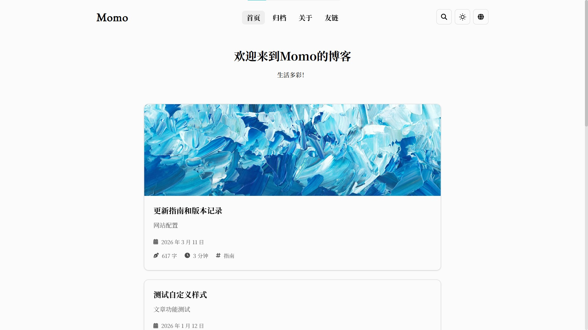

# Miles 个人博客

一个以长期写作和知识整理为核心的个人数字花园。网站基于 [Momo](https://github.com/Motues/Momo) 的 Astro 框架重建，计划用于持续发布学习资料、长文、短想法、个人信息、项目记录与人生经历。

> 当前阶段：**阶段 1｜个人品牌与素材盘点已完成**
>
> 当前版本：`stage-1-personalized`
>
> 更新日期：2026-09-10
>
> 线上地址：[https://miles-gift.github.io/](https://miles-gift.github.io/)



## 项目目标

这个项目不是简单替换模板头像和名称，而是要逐步建设一个有明确个人表达、易于持续维护的内容系统。

主要目标：

- 以 Markdown 长期保存内容，避免被封闭内容平台锁定。
- 统一整理学习文章、课程、书籍、论文、工具和参考链接。
- 分别承载长文章、短想法、个人经历、项目和个人介绍。
- 提供栏目、主题、标签、年份归档和全文搜索等发现方式。
- 建立低摩擦的内容创建、预览、检查、提交和自动发布流程。
- 通过 GitHub Pages 提供快速、低成本、可回滚的公开站点。
- 在保证阅读体验的前提下，形成类似 Apple 发布会的克制、聚焦和舞台式视觉语言。
- 明确公开、非公开、草稿和私人内容的边界，降低隐私风险。

项目完整规划、设计规范、内容模型、阶段任务和验收标准见 [BLOG_REBUILD_PLAN.md](BLOG_REBUILD_PLAN.md)。后续搭建以该文件为主要依据。

## 总体计划

项目分为九个阶段推进：

| 阶段 | 目标 | 当前状态 |
|---|---|---|
| 0. 基线固化 | 导入模板、验证构建、记录截图、确认发布链路 | 已完成 |
| 1. 品牌与内容盘点 | 明确站点名称、个人表达、栏目和首发素材 | 已完成 |
| 2. 设计系统 | 建立颜色、字体、间距、组件和动效规范 | 下一阶段 |
| 3. 内容模型 | 建立文章、资料、想法、经历等结构化内容 | 待开始 |
| 4. 首页与导航 | 重建舞台式首页和响应式导航 | 待开始 |
| 5. 内容页面 | 完成文章、资料库、时间线、关于、搜索等页面 | 待开始 |
| 6. CMS 与发布 | 扩展本地 CMS，贯通真实内容发布流程 | 待开始 |
| 7. 质量与上线 | 完成性能、SEO、无障碍、隐私和部署验收 | 待开始 |
| 8. 持续增强 | 在线 Studio、评论、统计、多语言和媒体库 | 长期规划 |

执行原则：每项任务都必须有明确目标、实施计划、验证结果和退出标准；任务完成后同步更新本 README 与总计划。

## 阶段 0 的目标

阶段 0 用于建立一个可构建、可验证、可追溯、可回滚的干净起点。在个性化设计和内容重建开始前，先确认模板源码、依赖、生产构建、本地预览、Git 远程和 GitHub Pages 工作流均处于可用状态。

## 阶段 0 的执行计划

1. 将 Momo 模板完整导入个人 GitHub Pages 仓库，同时保留原有 Git 历史。
2. 将个人仓库设置为 `origin`，将 Momo 模板设置为只用于同步的 `upstream`。
3. 明确 Node.js 与 pnpm 版本要求，安装锁文件指定的依赖。
4. 执行 Astro + Pagefind 生产构建。
5. 执行 CMS 独立生产构建。
6. 启动生产预览，检查桌面和移动端首页以及浏览器控制台。
7. 保存模板桌面、移动端和深色模式视觉基线。
8. 检查 GitHub Pages Actions 工作流，推送模板基线并验证线上部署。
9. 建立独立基线提交，为后续重建提供稳定回退点。

## 阶段 1 的目标

阶段 1 用于将站点从“可运行的 Momo 模板”转变为“有明确身份和内容方向的 Miles 个人站”。阶段目标是冻结可继续设计和内容建模的品牌输入，只发布由本人明确提供或由材料核验且已脱敏的事实，不虚构专业、职责或其他私人信息。

## 阶段 1 的执行计划

1. 盘点仓库中已有文章、笔记、媒体、About 与友链信息。
2. 将“用户明确提供”、“可公开验证”和“执行默认值”分开记录。
3. 确定站点名、署名、首页核心句、站点描述与写作语气。
4. 在没有真人照片授权的前提下，制作自有抽象标识。
5. 确定 5 个初始内容方向、顶级栏目、首发选题和内容公开边界。
6. 替换站点配置、首页文案和 About，关闭尚不需要的英文与友链入口。
7. 将 Momo 教程、测试和作者示例移出生产内容集，在内部文档中保留参考。
8. 创建一篇基于实际建站目标的首篇内容，完成构建、搜索、RSS、桌面和移动端验证。
9. 盘点本人授权的本地学习资料和评奖材料，将教育、成果、版权和隐私边界归档。

## 目前已经实现

### 仓库与模板

- 已将 Momo 26.8.15 完整导入当前仓库。
- 已核对导入文件与 Momo 提交 `24c37d2`，模板源码一致。
- `origin` 指向个人站点仓库：`Miles-gift/miles-gift.github.io`。
- `upstream` 指向模板仓库：`Motues/Momo`。
- 已保留 Momo 的 LICENSE、文档、示例内容、CMS 与部署工作流。

### 环境与依赖

- 已使用 pnpm 11.12.0 按 `pnpm-lock.yaml` 安装 468 个锁定包。
- 项目已增加 `.nvmrc`，推荐本地使用 Node.js 24 LTS。
- `package.json` 已声明 Node.js `>=24`、pnpm `>=11 <12`。
- GitHub Actions 固定使用 Node.js 24，并从 `packageManager` 字段读取 pnpm 11.12.0。
- 当前执行机器使用 Node.js 26.0.0，兼容构建已通过；最终发布以 CI 的 Node.js 24 构建为准。

### 构建与预览

- 阶段 0 模板基线曾生成 29 个页面；阶段 1 最新生产构建生成 6 个页面与 RSS。
- Pagefind 最新索引覆盖 3 个公开中文页面、336 个词条；模板示例和英文路由已退出生产索引。
- 构建过程完成 6 张图片优化。
- CMS 的 Vite 生产构建成功。
- 本地生产预览已在阶段 0 与阶段 1 分别验证。
- 已检查 1440×1000 桌面视口和 390×844 移动视口。
- 浏览器控制台没有 error 或 warn。
- 已归档桌面浅色、桌面深色和移动浅色模板截图。
- GitHub Actions 工作流 #2 已成功完成构建与部署。
- 线上首页、About、RSS、Pagefind 搜索资源和 404 行为已完成冒烟检查。

### 规划与文档

- 已完成详细的博客重建执行计划。
- 已完成 [品牌与内容简报](doc/BRAND_AND_CONTENT_BRIEF.md)，作为阶段 2–8 的设计与编辑输入。
- 已完成 [个人素材盘点与发布边界](doc/PERSONAL_CONTENT_INVENTORY.md)，记录本地学习笔记、课程材料、教育与成果的转换策略。
- 已定义内容边界、信息架构、内容模型和发布工作流。
- 已建立 Apple 发布会式设计方向与初始设计令牌。
- 已设定性能、SEO、无障碍、隐私、安全和测试基线。
- 已明确 GitHub Pages 是静态发布平台：P0 使用本地 CMS + Git 自动发布，P1 再评估安全的在线 Studio。

### 品牌与身份

- 站点名和公开署名已统一为 `Miles`。
- 站点副标题为“工程、学习与成长”。
- 首页核心句为“持续学习，也持续留下些什么。”
- 首页辅助句为“从电子设计、AI 到语言学习，记录正在发生的成长。”
- 站点描述为“Miles 的工程实践、学习笔记与成长记录。”
- 已创建自有抽象字母 M 标识，并作为 favicon 与临时头像基线。
- 首发阶段仅公开 [GitHub](https://github.com/Miles-gift)，没有将本地 Git 邮箱或其他未授权信息发布到网站。
- 已公开 2020—2023 江苏省靖江高级中学、2023—至今华中科技大学两段由本人提供的教育经历。
- 已核验并以脱敏文字公开国家奖学金、全国大学生电子设计竞赛本科组全国二等奖、挑战杯“揭榜挂帅”特等奖第一名三项成果；不公开证明原件、编号、队友或教师身份。
- 未提供的专业、培养层次、项目职责、城市和联系方式均未推测或虚构。

### 内容方向与治理

- 已确定电子设计与嵌入式、AI 与机器学习、工程工具、语言学习、长期知识整理 5 个真实内容方向。
- 已冻结“首页 / 文章 / 资料库 / 旅程 / 关于”的首发主导航命名，将在阶段 3–5 实现完整路由。
- 已建立 Public / Draft / Private 分级、个人内容发布前检查和版权边界。
- 已盘点 PyTorch、uv、Git、Mac 快捷键和雅思 Markdown 笔记，并将其列入重写、实测和来源复核队列。
- 已盘点 AI Agent 课程视频及评奖材料：第三方视频、题库、证书扫描件和身份信息不会进入公开仓库。
- 已建立首发选题队列；其中只有《从这里开始》和 About 内容已落地，其他选题等待真实素材。

### 公开站点去模板化

- 已替换站点标题、副标题、署名、首页文案、站点描述和 favicon。
- 已重写中文 About，内容聚焦站点目的、当前方向、记录原则、公开边界与联系方式。
- 已创建第一篇 Miles 公开内容《从这里开始》。
- 原 Momo 的 30 个博客文本/媒体文件、2 份英文说明和原作者头像已迁移到 `doc/template-content/`，保留为内部开发参考，不再生成公开页面。
- 已将语言路由收缩为简体中文，页面不再显示没有真实内容的英文切换。
- 友链条目已清空，桌面和移动导航都已移除友链入口；原路由暂保留未开放说明。
- 评论仍保持关闭，没有连接模板默认后端。

## 当前站点特点

### 阅读与内容

- Markdown 内容集合。
- 文章分类、置顶、草稿、封面、目录、字数和阅读时间。
- KaTeX 数学公式和 Typst 渲染。
- Alert、引用、GitHub 卡片、音乐卡片等自定义内容组件。
- PhotoSwipe 图片浏览和低质量图片占位。
- RSS 订阅。

### 查找与语言

- Pagefind 本地全文搜索，不依赖远程搜索服务。
- 生产站点当前仅生成简体中文；代码库仍保留英文国际化基础，可在有真实双语内容后重新启用。
- 年份归档和分类筛选。

### 界面与体验

- 响应式桌面和移动端布局。
- 浅色、深色和跟随系统主题。
- 移动端导航抽屉和悬浮操作菜单。
- Astro 静态输出，前台 JavaScript 较少。

### 内容管理

- 本地 CMS 管理后台。
- 文章概览、搜索、筛选、排序和统计。
- Markdown 编辑与实时预览。
- 封面图片上传。
- 中英文内容版本管理。
- 草稿、置顶、保存和删除保护。

### 自动部署

- 向 `main` 分支推送后触发 GitHub Actions。
- Actions 使用 Node.js 24 和 pnpm 11 安装依赖。
- 自动执行生产构建和 Pagefind 索引。
- 构建产物通过 GitHub Pages 发布。

## 目标信息架构

```text
/
├── /articles/       长文章、教程、复盘与系统思考
├── /resources/      课程、书籍、论文、工具和参考资料
├── /thoughts/       短想法与片段
├── /journey/        个人经历和成长时间线
├── /projects/       项目案例（P1，可先并入旅程）
├── /archive/        年份与月份归档
├── /about/          个人介绍和本站说明
├── /search/         全站搜索
├── /privacy/        隐私和版权说明
└── /rss.xml         RSS 订阅
```

首发导航计划控制为：首页、文章、资料库、旅程、关于。短想法、归档、标签和 RSS 作为辅助入口。

## 目标视觉方向

网站将借鉴 Apple 发布会的表达方法，但不会复制 Apple 的品牌资产或页面：

- 用大标题和宽阔留白建立清晰的舞台焦点。
- 首页按章节讲述“我是谁、正在做什么、有什么值得阅读”。
- 使用黑、白、低饱和灰和单一蓝色强调色。
- 界面优先系统无衬线字体，长文保留适合中文阅读的字体选择。
- 重点内容使用大幅高质量媒体，普通内容使用更紧凑的信息层级。
- 动效只服务于揭示、定位和反馈，并支持减少动态效果偏好。
- 深色模式单独调校，而不是简单反色。
- 移动端优先保证触控、阅读、搜索和菜单体验。

## 技术栈

| 类别 | 技术 |
|---|---|
| 框架 | Astro 7 |
| 交互组件 | Svelte 5 |
| 样式 | Tailwind CSS 4 + CSS Variables |
| 语言 | TypeScript |
| 内容 | Markdown + Astro Content Collections |
| 搜索 | Pagefind |
| 图片 | Sharp + Astro Assets |
| 内容扩展 | Remark/Rehype、KaTeX、Typst、PhotoSwipe |
| 本地 CMS | Vite + Hono + TypeScript |
| 包管理器 | pnpm 11 Workspaces |
| CI/CD | GitHub Actions |
| 托管 | GitHub Pages |

## 本地运行

### 环境要求

- Node.js 24 LTS 推荐；项目允许 Node.js `>=24`。
- pnpm 11。
- Git。

如果使用 nvm：

```bash
nvm use
```

安装依赖：

```bash
pnpm install --frozen-lockfile
```

启动博客开发服务器：

```bash
pnpm dev
```

默认访问：`http://localhost:4321/`

启动本地 CMS：

```bash
pnpm cms
```

默认访问：`http://localhost:5188/`

创建文章：

```bash
pnpm newpost docs/example.md zh-cn
```

生产构建：

```bash
pnpm build
```

预览生产构建：

```bash
pnpm preview
```

单独验证 CMS 构建：

```bash
pnpm --filter cms build
```

## 内容位置

- 当前公开文章：`src/content/blog/`，阶段 1 仅有《从这里开始》。
- 关于与友链说明：`src/content/spec/`。
- Momo 模板示例归档：`doc/template-content/blog/`，不参与生产构建。
- 品牌与内容基线：`doc/BRAND_AND_CONTENT_BRIEF.md`。
- 个人素材分级与转换队列：`doc/PERSONAL_CONTENT_INVENTORY.md`。
- 品牌标识：`public/brand/miles-mark.svg`。
- 图片资源：`src/assets/`、`public/` 或对应文章目录。
- 网站配置：`src/config.ts`。
- 内容 schema：`src/content.config.ts`。
- 国际化：`src/i18n/`。

阶段 3 会将真实内容逐步建模为 `articles`、`resources`、`thoughts`、`journey` 和 `pages` 等内容集合。在迁移完成前，不应同时维护两套真实内容。

## 项目目录

```text
.
├── .github/workflows/          GitHub Actions 构建与发布
├── cms/                        本地内容管理后台
├── doc/                        项目文档、视觉基线与模板内容归档
│   ├── baseline/               阶段 0 截图和说明
│   ├── template-content/       不参与构建的 Momo 示例
│   ├── BRAND_AND_CONTENT_BRIEF.md
│   └── PERSONAL_CONTENT_INVENTORY.md
├── public/                     不经处理的静态资源与品牌标识
├── script/                     内容创建脚本
├── src/
│   ├── assets/                 由 Astro 处理的资源
│   ├── components/             页面与交互组件
│   ├── content/                Markdown 内容
│   ├── i18n/                   多语言文本
│   ├── layouts/                页面布局
│   ├── pages/                  路由页面
│   ├── plugins/                Markdown 插件
│   ├── styles/                 全局和正文样式
│   └── utils/                  内容、URL 和图片工具
├── BLOG_REBUILD_PLAN.md        项目总计划和验收标准
├── astro.config.mjs            Astro 配置
├── package.json                根项目脚本与依赖
└── pnpm-lock.yaml              锁定依赖
```

## 发布流程

P0 阶段采用 Git-based 发布：

1. 拉取最新 `main`。
2. 使用本地 CMS 或 Markdown 创建内容。
3. 本地预览并完成内容检查。
4. 在功能分支提交和推送。
5. 构建检查通过后合并到 `main`。
6. GitHub Actions 自动构建并发布到 GitHub Pages。
7. 在线检查正文、图片、搜索、RSS 和分享元数据。

“实时上传”在首发阶段表示本地即时预览和推送后的分钟级自动发布。GitHub Pages 不能直接运行写入后台；需要跨设备在线编辑时，再建设带 OAuth 和最小权限控制的独立 Studio。

## Git 远程与上游同步

```text
origin    https://github.com/Miles-gift/miles-gift.github.io.git
upstream  https://github.com/Motues/Momo.git
```

日常只向 `origin` 推送。检查 Momo 更新：

```bash
git fetch upstream
git log --oneline --left-right main...upstream/main
```

上游更新必须在独立分支评估。优先同步安全修复和兼容性修复；个性化视觉代码不直接由上游覆盖。

## 视觉基线

阶段 0 已保存以下基线：

- [桌面端浅色](doc/baseline/template-desktop-light.jpg)
- [桌面端深色](doc/baseline/template-desktop-dark.jpg)
- [移动端浅色](doc/baseline/template-mobile-light.jpg)
- [视觉基线说明](doc/baseline/README.md)

这些基线用于阶段 2 和阶段 4 的视觉对比，不代表最终设计。

## 验证记录

2026-09-09 阶段 0：

| 检查 | 结果 |
|---|---|
| `pnpm install --frozen-lockfile` | 通过，468 packages |
| `pnpm build` | 通过，29 pages |
| Pagefind | 通过，22 pages / 2020 words / 2 languages |
| `pnpm --filter cms build` | 通过 |
| 桌面生产预览 | 通过，1440×1000 |
| 移动生产预览 | 通过，390×844 |
| 浏览器 console | 0 error / 0 warn |
| 视觉基线 | 已归档 3 张截图 |
| GitHub Actions Node.js | 24 |
| GitHub Actions workflow #2 | 通过，提交 `333223d` |
| GitHub Pages 部署 | 通过，Astro 模板已接管线上首页 |
| 线上首页 `/` | HTTP 200，标题 `Momo - Blog` |
| 线上 About `/about/` | HTTP 200 |
| 线上 RSS `/rss.xml` | HTTP 200 |
| 线上 Pagefind `/pagefind/pagefind.js` | HTTP 200 |
| 线上缺失页面 | HTTP 404，行为正确 |
| 模板 Umami 统计脚本 | 已移除，线上 HTML 未发现 |

已知提示：使用本机 Node.js 26 构建时出现 Node `module.register()` 的弃用提示，但构建成功。CI 固定 Node.js 24，若 CI 无此提示则视为本机新版本兼容性提醒；若依然出现，再追踪上游依赖。

首次 Actions 运行曾因 `package.json` 与工作流重复指定不同粒度的 pnpm 版本而失败；现已删除工作流中的重复版本输入，统一从 `packageManager: pnpm@11.12.0` 读取，第二次运行成功。该问题和修复均保留在 Git 历史中。

2026-09-09 至 2026-09-10 阶段 1：

| 检查 | 结果 |
|---|---|
| `pnpm build` | 通过，生成 6 个静态页面与 RSS |
| Pagefind | 通过，索引 3 个中文页面 / 336 words / 1 language |
| `pnpm --filter cms build` | 通过 |
| 首页 | 显示 Miles 标题、核心句和《从这里开始》 |
| About | 显示站点定位、两段教育经历、三项脱敏成果、5 个内容方向、公开边界和 GitHub 链接 |
| 桌面导航 | 只有首页、归档、关于，没有友链和英文切换 |
| 390×844 移动端 | 首页布局和导航抽屉通过，无水平溢出 |
| 浏览器 console | 0 error / 0 warn |
| 标识资源 | `/brand/miles-mark.svg` HTTP 200，favicon 正常请求 |
| RSS | 只包含 Miles 站点标题与《从这里开始》 |
| 语言 | 构建只发现 `zh-cn`，不再生成 `/en/` 路由 |
| 模板示例 | Momo 文章标题与作者随笔未出现在生产 HTML 或 RSS |
| 模板归档 | 30 个博客示例文本/媒体文件、2 份英文说明与原作者头像已移至 `doc/template-content/` |
| 本地素材盘点 | 已形成学习资料转换队列；第三方课程和证明原件不进入仓库 |
| 隐私边界 | 未复制学号、证书编号、证明扫描件、队友与教师身份信息 |

页脚仍保留指向 Momo 上游仓库的作品归属链接；这是对技术基线的透明说明，不是公开内容对 Momo 示例的依赖。

## 当前限制与下一步

当前站点已经完成身份与内容基线，但仍处于从模板向完整个人站过渡的早期阶段：

- 页面布局、字体、卡片和动效仍主要使用 Momo 默认设计，尚未完成 Apple 发布会式设计系统。
- 公开内容目前只有一篇建站记录与 About，尚未达到首发的内容数量基线。
- 教育与三项成果已有可信基线；专业、培养层次、项目个人职责和可公开技术细节仍待本人补充。
- 本地学习笔记尚未完成版权、来源、版本实测与原创重写，阶段 1 只做盘点，不原样发布。
- 尚未建立资料库、短想法和经历内容集合。
- 本地 CMS 目前主要管理博客文章，尚未支持全部目标内容类型。
- 评论仍保持关闭；在部署自有服务并完成隐私审查前不会启用。
- 英文和友链暂不在导航显示，只在有真实内容需求后恢复。

下一阶段是“设计系统”。将把颜色、字体、间距、圆角、阴影、层级和动效固化为令牌，建立 Button、Chip、IconButton、Section 和 PageHero 基础组件，并用设计验证页检查深浅主题和减少动效偏好。

## 文档维护规则

从阶段 0 开始，每次任务完成后必须更新本 README，至少记录：

- 本次任务的目标。
- 执行计划。
- 已实现内容。
- 新增或变化的功能与特点。
- 关键技术决定。
- 验证和测试结果。
- 当前限制或风险。
- 下一步建议。

详细任务继续同步到 [BLOG_REBUILD_PLAN.md](BLOG_REBUILD_PLAN.md) 的 checklist、决策日志和变更记录；README 保持为面向项目整体的最新概览。

## 上游与许可

本项目基于 [Motues/Momo](https://github.com/Motues/Momo) 开发。模板代码许可见 [LICENSE](LICENSE)。个人原创内容和媒体的许可将在首发前单独声明；在声明完成前，不应假设全部内容都可自由转载。
